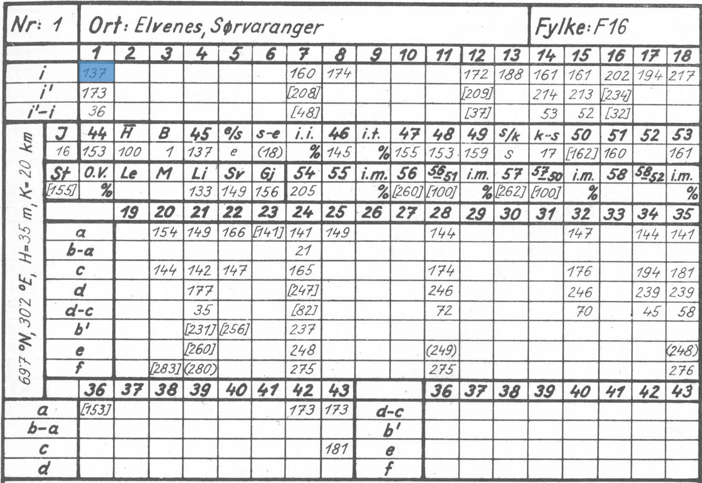

# Professor Printz and his phenology data

Phenology is, according to [Wikipedia](https://en.wikipedia.org/wiki/Phenology):

> the study of periodic events in biological life cycles and how these are influenced by seasonal and interannual variations in climate, as well as habitat factors (such as elevation)

It is arguably one of the oldest of mans sciences since the very survival of our species depended (and depends) on this knowledge.  Knowing for instance about migratory patterns of animals allowed for effective hunting, observations about plants allowed for effective sowing and harvesting and thereby planning of food supply etc.  A lot is known, of course, about phenology, but there have been relatively few systematic and official efforts dedicated to collection of such information.

In Norway, a large effort at collecting phenological data concerning plants, birds and agricultural phenomena was undertaken in 1928 by a botanist at the University of Oslo, Henrik Printz.  He established an extensive network of observers all over Norway and tasked them with observing a large number of different phenological phases such as flowering and budburst of different plants, arrival of certain migratory birds etc.

In the 1959 publication

> A. Lauscher, F. Lauscher, and H. Printz, *Die Phänologie Norwegens, Teil II. Phänologischce Mittelwerte für 260 Orte*, Skr. Det Norske Videnskaps-Akademi Oslo. I. Mat.-Naturv. Kl. No.l 1959, 1-176, 1959

he published observations from 278 observation stations for the years 1928 to 1952.  The article, 182 pages long and written in German, contains the data from each observation station in the form of handwritten tables looking like this:

For instance, the cell indexed as row i and column 1 (shown in blue in the figure above) represents the Julian date of the first flowering of a tiny plant called [Coltsfoot](https://en.wikipedia.org/wiki/Tussilago) (in Latin, *tussilago farfara*).  [Julian dates](https://en.wikipedia.org/wiki/Julian_day) , as used in this article, are just the day number after the 1st of January, so in a non-leap year the Julian date 137 corresponds to the 17th of May.

The coltsfoot is interesting since it is a so-called phenologically plastic plant.  It will basically start its lifecycle when local climatic conditions permit.  If spring is early a year it will blossom early, if spring is cold and late it will blossom later.  So you can think of these tiny plants a climatic laboratories spread all over Norway.

So why should we care about these old data?  Well, the observation period coincides with a period when the human contribution of potential greenhouse gases was much lower than today (see [here](https://www.climate.gov/media/14596) for instance for an overview of the evolution of CO2 in the athmosphere since 1750).  In this sense, Henrik Printz’s data represents a *time capsule* of indirect climatic observations that is soon to be a hundred years old.  It serves as a very simple baseline against which we can compare todays conditions and verify if indeed natures phenological phases have been influenced by a possible climatic change.

You will find the scanned pages containing the phenological tables from the original article as a Huggingface dataset here:

[tables.tgz](https://huggingface.co/datasets/findableai/phenology/blob/main/tables.tgz)

Unpack this dataset into the ./data/raw folder.

In this repository you will find:

1) A Jupyter notebook to extract, from every table, a specific cell as an image and code to use a visual large language model (vLLM) to perform an initial reading of these cells
3) A Jupyter notebook that shows how to finetune the vLLM to read the data more precisely.
4) Pandas data frames containing the observations in digital format.
5) A Jupyter notebook containing some examples of how this data can be used to make geoplots of the variability of the data in Norway.

At [Findable AS](https://www.findable.ai/) we do document understanding for the building industry.  This current project is a “labor of love” that we release to the public domain as a token of appreciation for all the different open source tools that we use in our daily work.  We hope this will be of interest to at least some people, and we believe (and fear) that the data will show that nature, in Norway, has not gone uninfluenced by climatic changes.  We welcome suggestions for improvements and additions and hope people will surprise us with their own uses of this data.  If you continue work on this data we demand that you kindly maintain the reference to the original article by Henrik Printz cited above.  Likewise, a kind mention of Findable and the work we put into digitising this would be appreciated 😄.

A few observations about the data:
1. There are 278 tables corresponding to the 278 observation locations.
2. Every table contains 4 metadata fields (show in yellow below) and 292 data fields (shown in blue):

3. There are 83.956 fields all in all, but as can be observed above not all observation were made in every location.
4. There are a total of 33.905 cells that are not blank.
5. Note: The meaning of the parenthesis and the brackets are as follows: Numbers in __parenthesis__ are averages over __only one or two years__, numbers in brackets are averages over __only 3 or 4 years__.

### Disclaimer
We present this data *in good faith and as is* without any claims, either direct nor implied, as to their usability for any purpose whatsoever.

Findable AS nor the authors make any claim as to the correctness of the data and shall not be held liable for any consequences, either direct or indirect, of the use or interpretation of this data.

Any conclusions or inferences drawn from this data are at the sole discretion of the entities setting forth such conclusions or inferences.
 
